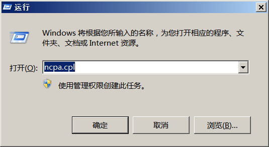
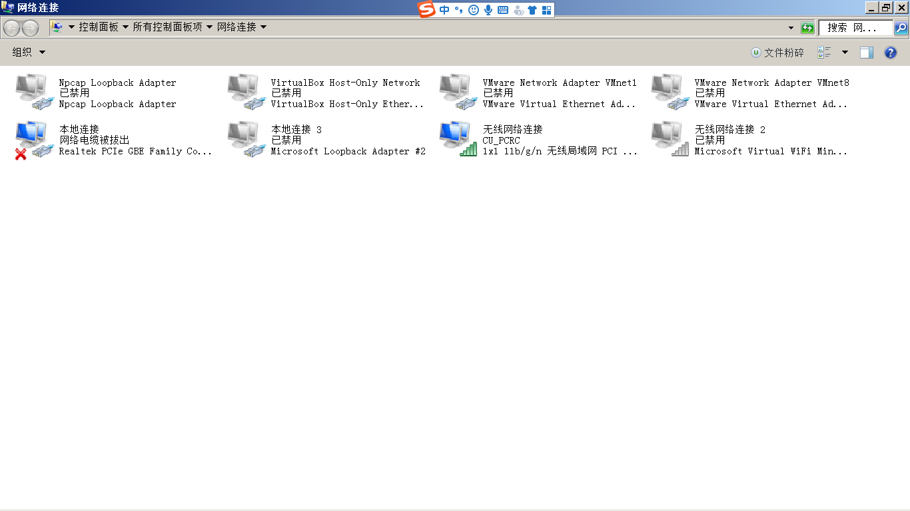
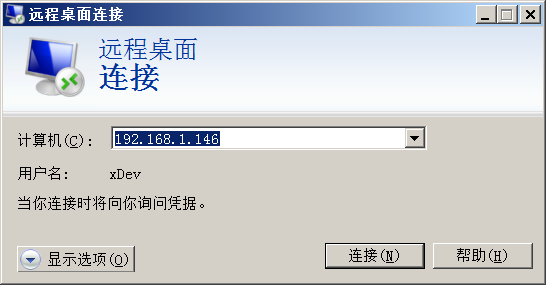
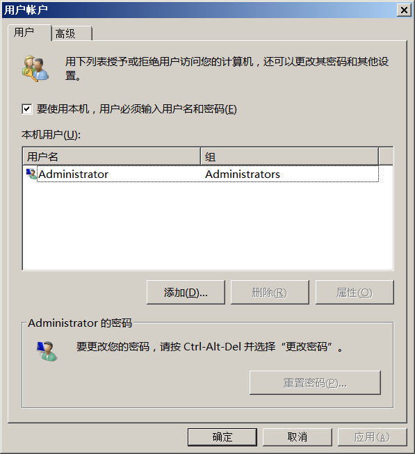
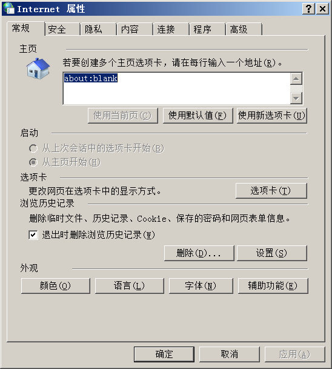
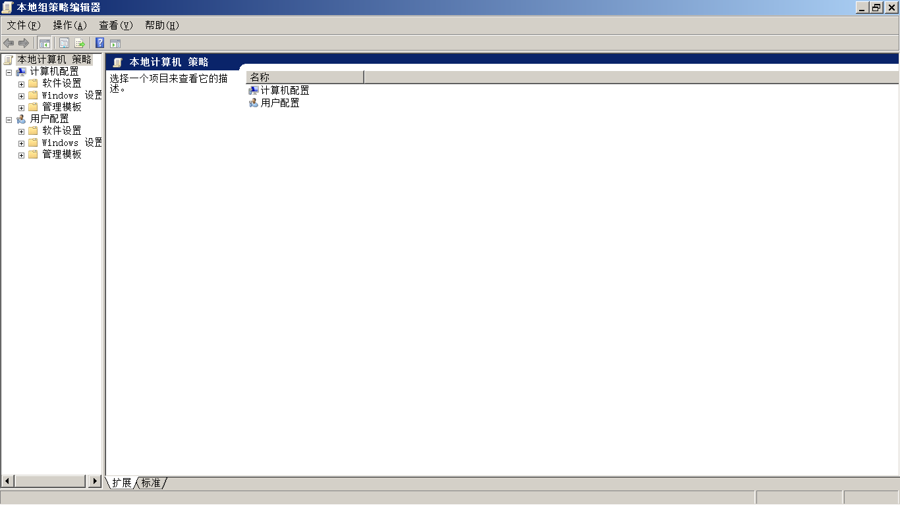

# 使用短命令进入相关设置


这篇文章提供了几个短命令，在网络运维和系统运维过程中可以通过运行窗口输入几个命令进入相关设置。<!--more-->

## 进入系统的运行窗口

通过按windows徽标键+R，可以打开运行窗口



## 进入网络设置

通常如果你为银行安装网络，银行电脑通过安全措施，你不能够使用网上邻居功能进入网卡设置。此时你可以通过输入短命令ncpa.cpl进入网卡设置。如图：



同时如果短命令不能进入网卡设置界面，此时可以通过命令行进行输入。

```bash
#设置ip地址和网关
netsh interface ip set address "以太网" source=static addr=172.16.10.16 mask=255.255.255.0 gateway=172.16.10.254
#设置dns
netsh interface ip set dns "以太网" source=static address=114.114.114.114 validate=no
```

其中“以太网”是你电脑网卡的名字，可以通过命令行运行ipconfig来获取，例如：

```bash
C:\Users\Administrator>ipconfig

Windows IP 配置

#此处的网卡名称叫做：[本地连接]，要用英文分号替换上面的“以太网”
以太网适配器 本地连接:

   媒体状态  . . . . . . . . . . . . : 媒体已断开
   连接特定的 DNS 后缀 . . . . . . . :

#此处的网卡名称叫做：[无线网络连接]，要用英文分号替换上面的“以太网”
无线局域网适配器 无线网络连接:

   连接特定的 DNS 后缀 . . . . . . . :
   IPv6 地址 . . . . . . . . . . . . : 2408:8215:d18:9af0:a454:e205:8fff:f2e1
   本地链接 IPv6 地址. . . . . . . . : fe80::a454:e205:8fff:f2e1%11
   IPv4 地址 . . . . . . . . . . . . : 192.168.1.6
   子网掩码  . . . . . . . . . . . . : 255.255.255.0
   默认网关. . . . . . . . . . . . . : fe80::1%11
                                       192.168.1.1
```

## 进入远程控制

你可以通过输入短命令mstsc进入远程控制设置。如图：



## 进入用户设置

可以通过输入短命令netplwiz进入用户设置，可取消开机密码。如图：



## 进入IE设置

通过输入短命令inetcpl.cpl，打开 IE设置选项。如图：



## 进入系统策略管理器

通过输入短命令gpedit.msc进入策略管理器。如图：



